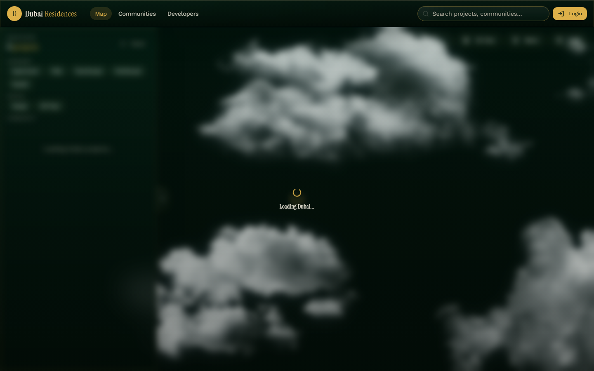

# Dubai Skyview

An interactive 3D real-estate map of Dubai. Browse off-plan and ready projects on a Mapbox-powered 3D city view with custom water, cloud, and metro layers, filter by community, developer, price, and bedrooms, and drill into project detail pages backed by Supabase.



## Tech Stack

| Area | Technology |
|---|---|
| Framework | [TanStack Start](https://tanstack.com/start) (React 19, SSR via Nitro) + Vite |
| Routing / data | TanStack Router (file-based routes) + TanStack Query |
| Map | Mapbox GL JS v3 with custom Three.js layers (3D models, animated water, clouds) |
| State | Zustand (`src/store/filters.ts`) |
| Backend | Supabase (PostgreSQL, Auth, RLS, migrations in `supabase/`) |
| Auth | Lovable Cloud Auth (`@lovable.dev/cloud-auth-js`) |
| UI | Tailwind CSS v4, shadcn/ui (Radix primitives), Framer Motion, Lucide icons |
| Forms / validation | react-hook-form + Zod |
| Deployment | Vercel (`vercel.json`) |

## Features

- **Interactive 3D map** — Mapbox Standard style with camera animations, project markers clustered via Supercluster, and rich popups (`src/components/map/`).
- **Custom map layers** — animated water surfaces (`WaterLayer.ts`, `waterWaveModel.ts`), drifting cloud sprites (`CloudLayer.tsx`), and glTF 3D models rendered through a shared Three.js renderer (`src/lib/mapbox/`).
- **Dubai geodata** — metro network (generated from real route data), shorelines, marine/navigation routes, and community boundaries (`src/lib/`).
- **Project browsing** — filterable listings by category, status, community, price range, and bedrooms; detail pages at `/projects/$slug`; communities and developers indexes.
- **Admin tools** — protected `/admin` route with a location picker for placing projects on the map, plus a live water-styling debug editor.
- **Auth-gated routes** — `src/routes/_authenticated/` is protected via Lovable auth with Supabase row-level security behind it.

## Getting Started

### Prerequisites

- Node.js 22+ (or [Bun](https://bun.sh) — a `bun.lock` is included)
- A [Mapbox](https://www.mapbox.com/) access token
- A [Supabase](https://supabase.com/) project (or Lovable Cloud, which provisions one)

### Setup

```bash
# Install dependencies
npm install        # or: bun install

# Configure environment (see below)
cp .env.example .env   # create .env if it doesn't exist

# Start the dev server (http://localhost:5174)
npm run dev
```

### Environment Variables

Create a `.env` file in the project root:

| Variable | Scope | Description |
|---|---|---|
| `VITE_SUPABASE_URL` | client | Supabase project URL |
| `VITE_SUPABASE_PUBLISHABLE_KEY` | client | Supabase anon/publishable key |
| `MAPBOX_ACCESS_TOKEN` | server | Mapbox GL access token |
| `SUPABASE_URL` | server | Supabase URL for server functions |
| `SUPABASE_PUBLISHABLE_KEY` | server | Supabase publishable key for server functions |
| `SUPABASE_SERVICE_ROLE_KEY` | server | Service-role key (admin operations only — never expose to the client) |
| `GOOGLE_MAPS_API_KEY` | server | Optional, for Google geodata lookups |
| `VITE_WATER_DEBUG` | client | Optional: `true` enables the water debug editor |
| `VITE_NAVIGATION_DEBUG_OVERLAY` | client | Optional: `true` shows the marine-navigation debug overlay |

### Database

Migrations and seed data live in `supabase/`:

```bash
supabase db push                                  # apply migrations
psql < supabase/seed_dubai_sample_projects.sql    # optional sample data
```

## Scripts

| Command | Description |
|---|---|
| `npm run dev` | Start Vite dev server with HMR |
| `npm run build` | Production build |
| `npm run build:dev` | Build in development mode |
| `npm run preview` | Preview the production build locally |
| `npm run lint` | Run ESLint |
| `npm run format` | Format with Prettier |
| `npm run validate:marine` | Validate the marine route/navigation data model |

## Project Structure

```
dubai-skyview/
├── public/
│   ├── models/               # glTF 3D models rendered on the map
│   └── cloud*.webp           # Cloud layer sprites
├── src/
│   ├── routes/               # TanStack Router file-based routes
│   │   ├── index.tsx         # Home — full-screen map
│   │   ├── projects.$slug.tsx# Project detail page
│   │   ├── communities.index.tsx
│   │   ├── developers.index.tsx
│   │   ├── auth.tsx          # Sign-in
│   │   └── _authenticated/   # Protected routes (admin)
│   ├── components/
│   │   ├── map/              # MapContainer, MapboxView, water/cloud layers, popups
│   │   ├── layout/           # AppNavbar, AppSidebar
│   │   └── ui/               # shadcn/ui components
│   ├── lib/
│   │   ├── mapbox/           # Three.js model layer, water wave model, debug overlays
│   │   ├── dubai.ts          # Dubai constants & landmarks
│   │   ├── metro*.ts         # Metro network data
│   │   ├── shorelines.ts     # Coastline geometry
│   │   ├── marineRoutes.ts   # Marine navigation routes
│   │   └── water.ts          # Water feature data
│   ├── hooks/                # use-auth, use-projects, use-map-config, use-mobile
│   ├── store/                # Zustand filter store
│   └── integrations/         # Supabase & Lovable clients
├── supabase/                 # Config, migrations, seed SQL
├── scripts/                  # Data conversion & validation scripts
└── vercel.json               # Vercel deployment config
```

A deeper breakdown of the data model and architecture is in [PROJECT_STRUCTURE.md](PROJECT_STRUCTURE.md).

## Additional Documentation

- [PROJECT_STRUCTURE.md](PROJECT_STRUCTURE.md) — file tree, database schema, data-flow architecture
- [MAP_LOADING_OPTIMIZATION.md](MAP_LOADING_OPTIMIZATION.md) — map performance notes
- [WATER_CUSTOMIZATION.md](WATER_CUSTOMIZATION.md) — water layer styling guide
- [AGENTS.md](AGENTS.md) — notes for AI coding agents

## Deployment

The app deploys to Vercel. Push to the connected branch and Vercel builds via `npm run build`. This project is also connected to [Lovable](https://lovable.dev) — avoid rewriting published git history (force-push, rebase, amend), as it desyncs the Lovable editor.
